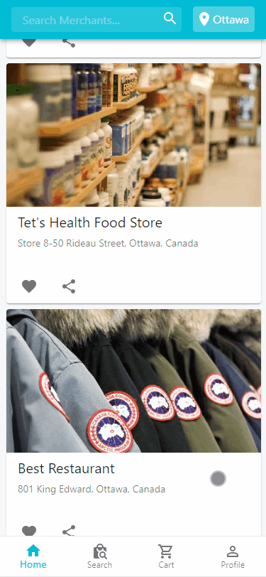
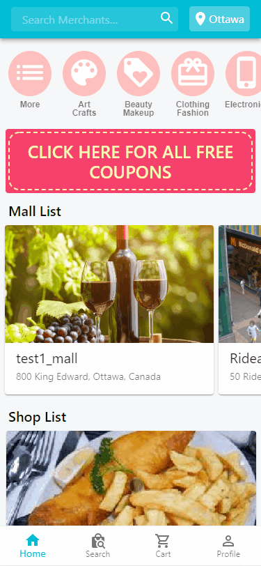
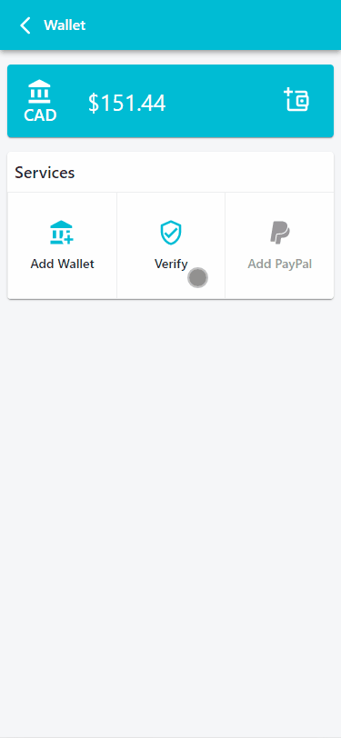
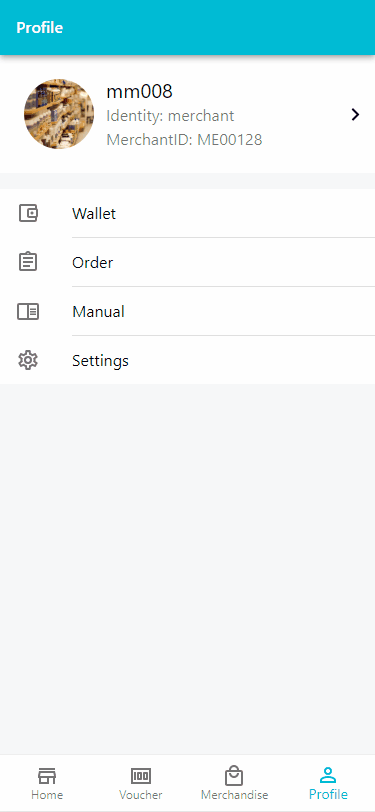

## BizMSM local E-commerce application

Our project is stored in a private repository. BizMSM aims to provide a possible solution for small businesses in their local area. BizMSM is not just an online store, it is also a platform for merchants who want to expand their business and consumer who would like to dig deeper about the local lifestyle.

Merchants can set up their accounts online and sell their products, or distribute vouchers efficiently.

Consumers can explore the area they are interested in, they can not only order online but also buy a voucher and redeem on-site with our QR code scanner that integrated into our app.

All transactions are protected by our blockchain technology, you can download your transactions and verify it using the standalone verifying tool to know your transactions are safe.

## Demo

### 1. Home Page

&nbsp;

### 2. Buy and Pay

&nbsp;

### 3. Search and Change location

&nbsp;

### 4. Verify transactions

&nbsp;

### 5. Merchant System

